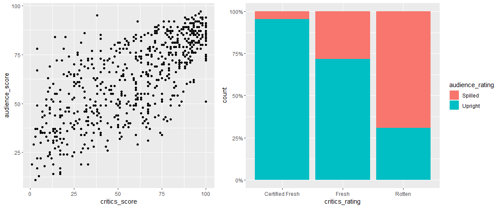
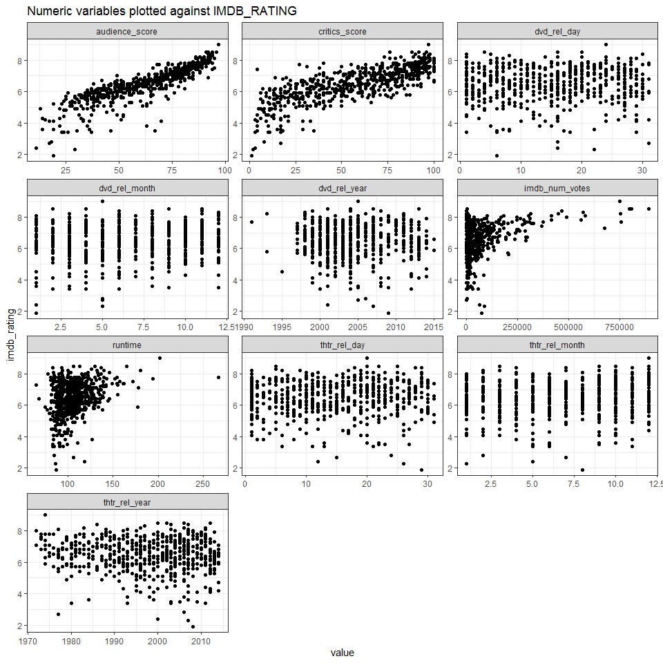
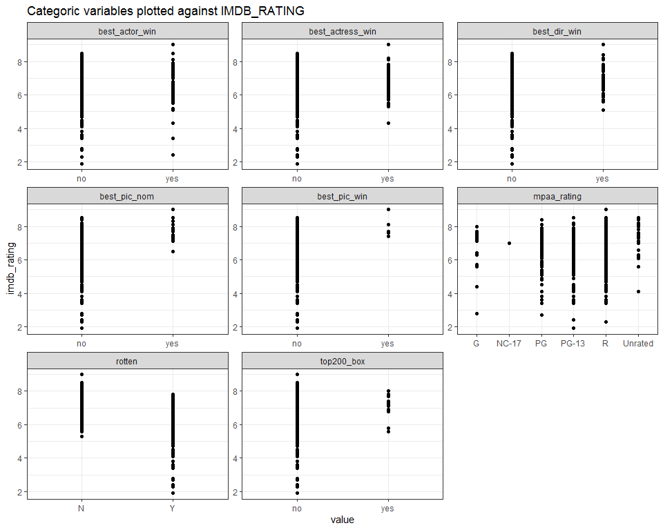
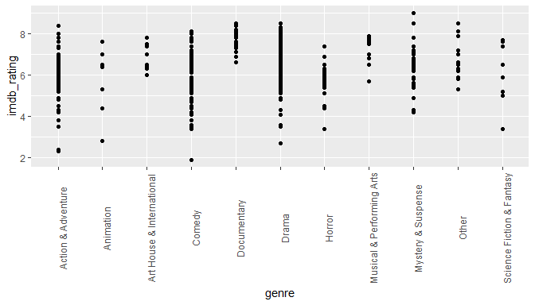
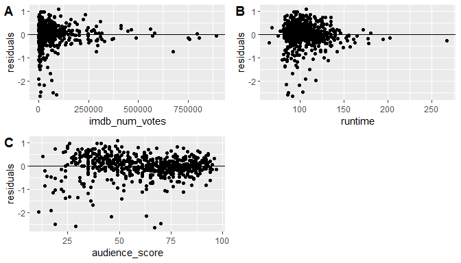
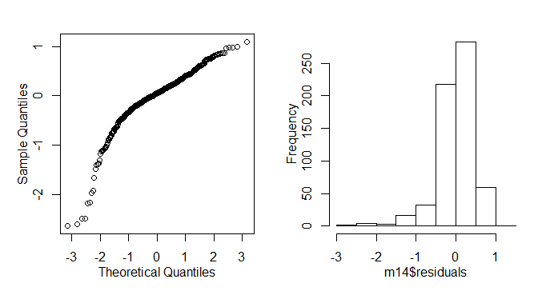
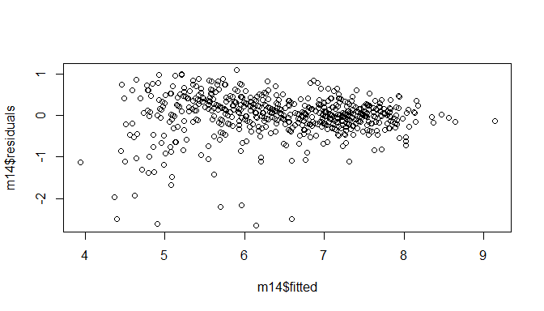
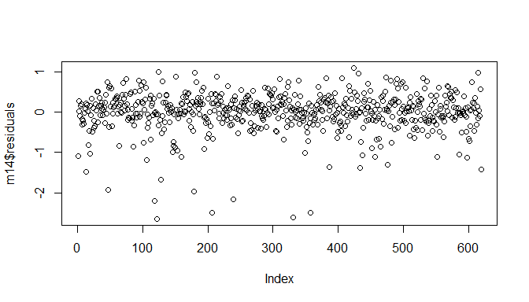

## Setup

### Load packages


```r
library(ggplot2)
library(dplyr)
library(statsr)
library(tidyr)
library(cowplot)
library(ggplotify)
library(purrr)
```

### Load data


```r
load("movies.Rdata")
```


* * *

# Part 1: Data

The data consists of randomly sampled movies, findings can be theoretically generalized to the population. However, data on only English movies has been collected, and only movies that can be found online. Thus, there may be reservations in generalizing to the population of all movies ever made. 

Additionally, very few attributes have been collected. There could be qualitative findings conducted via interviews that might yield better insights. 

This is an observational study without random assigment, thus there is no causality, only associations. 
* * *

# Part 2: Research question

>> What variables are associated with the popularity of a movie? 

This research question is of interest as our boss wants to know what attributes make a movie popular. 

* * *

# Part 3: Exploratory data analysis

First, we want to remove all NA values and then summarise the type and level of each variable


```r
movies<-na.omit(movies)
str(movies)
```

```
## tibble [619 x 32] (S3: tbl_df/tbl/data.frame)
##  $ title           : chr [1:619] "Filly Brown" "The Dish" "Waiting for Guffman" "The Age of Innocence" ...
##  $ title_type      : Factor w/ 3 levels "Documentary",..: 2 2 2 2 2 2 2 1 2 2 ...
##  $ genre           : Factor w/ 11 levels "Action & Adventure",..: 6 6 4 6 7 6 6 5 6 1 ...
##  $ runtime         : num [1:619] 80 101 84 139 90 142 93 88 119 127 ...
##  $ mpaa_rating     : Factor w/ 6 levels "G","NC-17","PG",..: 5 4 5 3 5 4 5 6 6 3 ...
##  $ studio          : Factor w/ 211 levels "20th Century Fox",..: 91 202 167 34 13 147 118 88 84 202 ...
##  $ thtr_rel_year   : num [1:619] 2013 2001 1996 1993 2004 ...
##  $ thtr_rel_month  : num [1:619] 4 3 8 10 9 1 11 9 3 6 ...
##  $ thtr_rel_day    : num [1:619] 19 14 21 1 10 1 8 7 2 19 ...
##  $ dvd_rel_year    : num [1:619] 2013 2001 2001 2001 2005 ...
##  $ dvd_rel_month   : num [1:619] 7 8 8 11 4 2 3 1 8 5 ...
##  $ dvd_rel_day     : num [1:619] 30 28 21 6 19 18 2 21 14 1 ...
##  $ imdb_rating     : num [1:619] 5.5 7.3 7.6 7.2 5.1 7.2 5.5 7.5 6.6 6.8 ...
##  $ imdb_num_votes  : int [1:619] 899 12285 22381 35096 2386 5016 2272 880 12496 71979 ...
##  $ critics_rating  : Factor w/ 3 levels "Certified Fresh",..: 3 1 1 1 3 3 3 2 1 1 ...
##  $ critics_score   : num [1:619] 45 96 91 80 33 57 17 90 83 89 ...
##  $ audience_rating : Factor w/ 2 levels "Spilled","Upright": 2 2 2 2 1 2 1 2 2 2 ...
##  $ audience_score  : num [1:619] 73 81 91 76 27 76 47 89 66 75 ...
##  $ best_pic_nom    : Factor w/ 2 levels "no","yes": 1 1 1 1 1 1 1 1 1 1 ...
##  $ best_pic_win    : Factor w/ 2 levels "no","yes": 1 1 1 1 1 1 1 1 1 1 ...
##  $ best_actor_win  : Factor w/ 2 levels "no","yes": 1 1 1 2 1 1 2 1 1 2 ...
##  $ best_actress_win: Factor w/ 2 levels "no","yes": 1 1 1 1 1 1 1 1 1 1 ...
##  $ best_dir_win    : Factor w/ 2 levels "no","yes": 1 1 1 2 1 1 1 1 1 1 ...
##  $ top200_box      : Factor w/ 2 levels "no","yes": 1 1 1 1 1 1 1 1 1 2 ...
##  $ director        : chr [1:619] "Michael D. Olmos" "Rob Sitch" "Christopher Guest" "Martin Scorsese" ...
##  $ actor1          : chr [1:619] "Gina Rodriguez" "Sam Neill" "Christopher Guest" "Daniel Day-Lewis" ...
##  $ actor2          : chr [1:619] "Jenni Rivera" "Kevin Harrington" "Catherine O'Hara" "Michelle Pfeiffer" ...
##  $ actor3          : chr [1:619] "Lou Diamond Phillips" "Patrick Warburton" "Parker Posey" "Winona Ryder" ...
##  $ actor4          : chr [1:619] "Emilio Rivera" "Tom Long" "Eugene Levy" "Richard E. Grant" ...
##  $ actor5          : chr [1:619] "Joseph Julian Soria" "Genevieve Mooy" "Bob Balaban" "Alec McCowen" ...
##  $ imdb_url        : chr [1:619] "http://www.imdb.com/title/tt1869425/" "http://www.imdb.com/title/tt0205873/" "http://www.imdb.com/title/tt0118111/" "http://www.imdb.com/title/tt0106226/" ...
##  $ rt_url          : chr [1:619] "//www.rottentomatoes.com/m/filly_brown_2012/" "//www.rottentomatoes.com/m/dish/" "//www.rottentomatoes.com/m/waiting_for_guffman/" "//www.rottentomatoes.com/m/age_of_innocence/" ...
##  - attr(*, "na.action")= 'omit' Named int [1:32] 6 25 94 100 131 172 175 184 198 207 ...
##   ..- attr(*, "names")= chr [1:32] "6" "25" "94" "100" ...
```

I will be using imdb_rating as the response variable. I have a feeling that critics score & rating and audience scores & rating on rotten tomatoes are correlated. So let's find out. 


```r
cor(movies$critics_score,movies$audience_score)
```

```
## [1] 0.7015256
```

This is a pretty high correlation. Let's check audience rating and critics rating using the chi-square test. 


```r
chisq.test(movies$critics_rating,movies$audience_rating,correct=FALSE)
```

```
## 
## 	Pearson's Chi-squared test
## 
## data:  movies$critics_rating and movies$audience_rating
## X-squared = 179.23, df = 2, p-value < 2.2e-16
```

The critics rating and audience rating are definitely dependent. We can also see these conclusions from the graphs below. 


```r
plot1<- ggplot(movies,aes(x=critics_score,y=audience_score))+geom_point()
plot2<- ggplot(movies) + aes(x=critics_rating,fill=audience_rating) + geom_bar(position="fill")+scale_y_continuous(labels = scales::percent)
plot_grid(plot1,plot2,ncol=2,rel_widths=c(1,1.3))
```

<!-- -->


We don't want collinear variables in the model, so we will use only audience score as using critics score and audience rating will add nothing new to the model.  

Additionally, instead of using critics rating, I want to simplify and introduce a variable that labels a movie as Rotten or not, depending on whether it has received a rotten critics_rating or not. 


```r
movies<-movies%>%mutate(rotten=as.factor(ifelse(critics_rating=="Rotten","Y","N")))
```


Let's also look at scatter plots of all the selected variables (numerical and categorical) against our response variable imdb_rating, to get an idea of what attributes show an association with popularity. 


```r
movies%>% keep(is.numeric)%>%  gather(-imdb_rating, key = "var", value = "value") %>%
  ggplot(aes(x = value, y = imdb_rating)) +
    geom_point() +
    facet_wrap(~ var, scales = "free",ncol=3) +
    theme_bw()+
    ggtitle("Numeric variables plotted against IMDB_RATING")
```

<!-- -->


It seems like audience_score has a definite linear relationship with imdb_rating. imdb_num_votes and runtime seem to have a weak linear relationship with imdb_rating. The rest of the variables seem to be randomly scattered. 

Now let's take a look at categorical variables and plot them against imbd_rating. 


```r
movies_cat<-movies[,c(13,5,19,20,21,22,23,24,33)]
movies_cat%>% gather(-imdb_rating, key = "var", value = "value") %>%
  ggplot(aes(x = value, y = imdb_rating)) +
    geom_point() +
    facet_wrap(~ var, scales = "free",ncol=3) +
    theme_bw()+
    ggtitle("Categoric variables plotted against IMDB_RATING")
```

```
## Warning: attributes are not identical across measure variables;
## they will be dropped
```

<!-- -->

In the case of the variable 'rotten', we see that there is a clear relationship where rotten movies have a lower imdb rating on average compared to non-rotten ones. The average ratings for movies with best_pic_nom/best_dir_win also seem to be higher. 


```r
movies%>% ggplot(aes(x = genre, y = imdb_rating)) +
    geom_point()+theme(axis.text.x = element_text(angle = 90))
```

<!-- -->

There seems to be a relationship between genre and imdb_ratings. Documentary genre is associated with higher imdb ratings on average. 

* * *

# Part 4: Modeling

Since we are tasked with learning what attributes makes a movie popular, and not just necessarily develop a model with the best predictions, we are choosing to go with backward selection based on the p-value. We start with the full model with all variables and then drop the variables with the highest p-values until we are left with a model that contains only significant explanatory variables.  

As mentioned before, we are using the variables audience score and rotten instead of critics score and audience rating. Also, we are not considering  the variables studio, director, and actor1 to actor5 as they have too many levels/categories. We are also not choosing the imdb_url or rt_url as these are meaningless to the exercise. Below is the full model.


```r
m1<-lm(formula=imdb_rating~title_type+genre+runtime+mpaa_rating+thtr_rel_year+thtr_rel_month+thtr_rel_day+dvd_rel_year+dvd_rel_month+dvd_rel_day+imdb_num_votes+audience_score+rotten+best_pic_nom+best_pic_win+best_actor_win+best_actress_win+best_dir_win+top200_box,data=movies)

summary(m1)
```

```
## 
## Call:
## lm(formula = imdb_rating ~ title_type + genre + runtime + mpaa_rating + 
##     thtr_rel_year + thtr_rel_month + thtr_rel_day + dvd_rel_year + 
##     dvd_rel_month + dvd_rel_day + imdb_num_votes + audience_score + 
##     rotten + best_pic_nom + best_pic_win + best_actor_win + best_actress_win + 
##     best_dir_win + top200_box, data = movies)
## 
## Residuals:
##      Min       1Q   Median       3Q      Max 
## -2.71583 -0.16806  0.03877  0.27333  1.06623 
## 
## Coefficients:
##                                  Estimate Std. Error t value Pr(>|t|)    
## (Intercept)                    -8.435e-01  9.805e+00  -0.086 0.931476    
## title_typeFeature Film         -3.522e-01  1.986e-01  -1.773 0.076718 .  
## title_typeTV Movie             -3.610e-01  3.183e-01  -1.134 0.257184    
## genreAnimation                 -6.043e-01  2.051e-01  -2.946 0.003342 ** 
## genreArt House & International  2.990e-01  1.632e-01   1.833 0.067370 .  
## genreComedy                    -1.327e-01  8.465e-02  -1.568 0.117381    
## genreDocumentary                1.349e-01  2.101e-01   0.642 0.521198    
## genreDrama                      1.368e-01  7.507e-02   1.822 0.068941 .  
## genreHorror                     1.367e-01  1.272e-01   1.075 0.282905    
## genreMusical & Performing Arts  8.551e-02  1.734e-01   0.493 0.622073    
## genreMystery & Suspense         2.930e-01  9.571e-02   3.061 0.002304 ** 
## genreOther                      4.740e-02  1.468e-01   0.323 0.746979    
## genreScience Fiction & Fantasy -7.930e-02  1.872e-01  -0.424 0.672031    
## runtime                         4.131e-03  1.301e-03   3.175 0.001575 ** 
## mpaa_ratingNC-17               -5.544e-02  5.167e-01  -0.107 0.914599    
## mpaa_ratingPG                  -2.101e-01  1.465e-01  -1.434 0.152051    
## mpaa_ratingPG-13               -2.298e-01  1.526e-01  -1.506 0.132598    
## mpaa_ratingR                   -1.677e-01  1.474e-01  -1.138 0.255654    
## mpaa_ratingUnrated             -2.273e-01  1.757e-01  -1.294 0.196247    
## thtr_rel_year                  -9.189e-04  2.762e-03  -0.333 0.739445    
## thtr_rel_month                  1.058e-02  6.071e-03   1.743 0.081901 .  
## thtr_rel_day                   -1.107e-03  2.299e-03  -0.482 0.630340    
## dvd_rel_year                    3.380e-03  6.078e-03   0.556 0.578331    
## dvd_rel_month                   8.854e-03  6.072e-03   1.458 0.145376    
## dvd_rel_day                     1.281e-03  2.274e-03   0.563 0.573361    
## imdb_num_votes                  8.809e-07  2.313e-07   3.808 0.000155 ***
## audience_score                  3.711e-02  1.404e-03  26.438  < 2e-16 ***
## rottenY                        -2.745e-01  5.188e-02  -5.291 1.72e-07 ***
## best_pic_nomyes                -8.323e-02  1.313e-01  -0.634 0.526482    
## best_pic_winyes                -4.871e-02  2.304e-01  -0.211 0.832612    
## best_actor_winyes               4.712e-02  6.012e-02   0.784 0.433539    
## best_actress_winyes             8.906e-02  6.579e-02   1.354 0.176358    
## best_dir_winyes                 8.194e-02  8.585e-02   0.955 0.340205    
## top200_boxyes                  -1.307e-01  1.392e-01  -0.939 0.347914    
## ---
## Signif. codes:  0 '***' 0.001 '**' 0.01 '*' 0.05 '.' 0.1 ' ' 1
## 
## Residual standard error: 0.4925 on 585 degrees of freedom
## Multiple R-squared:  0.8012,	Adjusted R-squared:   0.79 
## F-statistic: 71.45 on 33 and 585 DF,  p-value: < 2.2e-16
```

```r
#Dropping best_pic_win
m2<-lm(formula=imdb_rating~title_type+genre+runtime+mpaa_rating+thtr_rel_year+thtr_rel_month+thtr_rel_day+dvd_rel_year+dvd_rel_month+dvd_rel_day+imdb_num_votes+audience_score+rotten+best_pic_nom+best_actor_win+best_actress_win+best_dir_win+top200_box,data=movies)

summary(m2)
```

```
## 
## Call:
## lm(formula = imdb_rating ~ title_type + genre + runtime + mpaa_rating + 
##     thtr_rel_year + thtr_rel_month + thtr_rel_day + dvd_rel_year + 
##     dvd_rel_month + dvd_rel_day + imdb_num_votes + audience_score + 
##     rotten + best_pic_nom + best_actor_win + best_actress_win + 
##     best_dir_win + top200_box, data = movies)
## 
## Residuals:
##      Min       1Q   Median       3Q      Max 
## -2.71688 -0.16698  0.03892  0.27304  1.06582 
## 
## Coefficients:
##                                  Estimate Std. Error t value Pr(>|t|)    
## (Intercept)                    -8.514e-01  9.797e+00  -0.087 0.930777    
## title_typeFeature Film         -3.519e-01  1.984e-01  -1.773 0.076689 .  
## title_typeTV Movie             -3.608e-01  3.180e-01  -1.135 0.256949    
## genreAnimation                 -6.047e-01  2.049e-01  -2.951 0.003294 ** 
## genreArt House & International  2.981e-01  1.630e-01   1.829 0.067851 .  
## genreComedy                    -1.336e-01  8.448e-02  -1.581 0.114307    
## genreDocumentary                1.339e-01  2.099e-01   0.638 0.523877    
## genreDrama                      1.364e-01  7.499e-02   1.819 0.069392 .  
## genreHorror                     1.365e-01  1.271e-01   1.074 0.283083    
## genreMusical & Performing Arts  8.501e-02  1.732e-01   0.491 0.623810    
## genreMystery & Suspense         2.927e-01  9.562e-02   3.061 0.002303 ** 
## genreOther                      4.954e-02  1.464e-01   0.338 0.735115    
## genreScience Fiction & Fantasy -7.871e-02  1.870e-01  -0.421 0.674049    
## runtime                         4.127e-03  1.300e-03   3.175 0.001578 ** 
## mpaa_ratingNC-17               -5.614e-02  5.163e-01  -0.109 0.913444    
## mpaa_ratingPG                  -2.101e-01  1.464e-01  -1.435 0.151694    
## mpaa_ratingPG-13               -2.289e-01  1.524e-01  -1.502 0.133654    
## mpaa_ratingR                   -1.674e-01  1.472e-01  -1.137 0.256009    
## mpaa_ratingUnrated             -2.276e-01  1.755e-01  -1.297 0.195182    
## thtr_rel_year                  -8.868e-04  2.755e-03  -0.322 0.747670    
## thtr_rel_month                  1.067e-02  6.050e-03   1.764 0.078178 .  
## thtr_rel_day                   -1.125e-03  2.296e-03  -0.490 0.624493    
## dvd_rel_year                    3.352e-03  6.072e-03   0.552 0.581122    
## dvd_rel_month                   8.934e-03  6.056e-03   1.475 0.140647    
## dvd_rel_day                     1.262e-03  2.270e-03   0.556 0.578395    
## imdb_num_votes                  8.717e-07  2.270e-07   3.840 0.000137 ***
## audience_score                  3.712e-02  1.400e-03  26.516  < 2e-16 ***
## rottenY                        -2.747e-01  5.183e-02  -5.300 1.64e-07 ***
## best_pic_nomyes                -9.445e-02  1.200e-01  -0.787 0.431633    
## best_actor_winyes               4.806e-02  5.991e-02   0.802 0.422727    
## best_actress_winyes             8.842e-02  6.567e-02   1.346 0.178664    
## best_dir_winyes                 7.705e-02  8.260e-02   0.933 0.351309    
## top200_boxyes                  -1.307e-01  1.390e-01  -0.940 0.347553    
## ---
## Signif. codes:  0 '***' 0.001 '**' 0.01 '*' 0.05 '.' 0.1 ' ' 1
## 
## Residual standard error: 0.4921 on 586 degrees of freedom
## Multiple R-squared:  0.8012,	Adjusted R-squared:  0.7903 
## F-statistic:  73.8 on 32 and 586 DF,  p-value: < 2.2e-16
```

```r
#Dropping mpaa_rating
m3<-lm(formula=imdb_rating~title_type+genre+runtime+thtr_rel_year+thtr_rel_month+thtr_rel_day+dvd_rel_year+dvd_rel_month+dvd_rel_day+imdb_num_votes+audience_score+rotten+best_pic_nom+best_actor_win+best_actress_win+best_dir_win+top200_box,data=movies)

summary(m3)
```

```
## 
## Call:
## lm(formula = imdb_rating ~ title_type + genre + runtime + thtr_rel_year + 
##     thtr_rel_month + thtr_rel_day + dvd_rel_year + dvd_rel_month + 
##     dvd_rel_day + imdb_num_votes + audience_score + rotten + 
##     best_pic_nom + best_actor_win + best_actress_win + best_dir_win + 
##     top200_box, data = movies)
## 
## Residuals:
##      Min       1Q   Median       3Q      Max 
## -2.68759 -0.17971  0.04761  0.27410  1.03889 
## 
## Coefficients:
##                                  Estimate Std. Error t value Pr(>|t|)    
## (Intercept)                     1.204e+00  9.557e+00   0.126  0.89981    
## title_typeFeature Film         -3.369e-01  1.966e-01  -1.714  0.08703 .  
## title_typeTV Movie             -3.564e-01  3.166e-01  -1.126  0.26083    
## genreAnimation                 -5.021e-01  1.878e-01  -2.674  0.00770 ** 
## genreArt House & International  2.846e-01  1.592e-01   1.788  0.07436 .  
## genreComedy                    -1.500e-01  8.354e-02  -1.796  0.07303 .  
## genreDocumentary                1.200e-01  2.081e-01   0.577  0.56445    
## genreDrama                      1.331e-01  7.326e-02   1.817  0.06971 .  
## genreHorror                     1.415e-01  1.239e-01   1.142  0.25403    
## genreMusical & Performing Arts  7.938e-02  1.724e-01   0.460  0.64534    
## genreMystery & Suspense         3.013e-01  9.355e-02   3.221  0.00135 ** 
## genreOther                      3.040e-02  1.454e-01   0.209  0.83447    
## genreScience Fiction & Fantasy -6.610e-02  1.867e-01  -0.354  0.72335    
## runtime                         3.802e-03  1.266e-03   3.003  0.00278 ** 
## thtr_rel_year                  -1.143e-03  2.597e-03  -0.440  0.66010    
## thtr_rel_month                  1.122e-02  5.991e-03   1.873  0.06159 .  
## thtr_rel_day                   -1.371e-03  2.273e-03  -0.603  0.54684    
## dvd_rel_year                    2.498e-03  5.951e-03   0.420  0.67478    
## dvd_rel_month                   9.001e-03  6.031e-03   1.492  0.13610    
## dvd_rel_day                     1.041e-03  2.261e-03   0.460  0.64540    
## imdb_num_votes                  8.825e-07  2.240e-07   3.940 9.14e-05 ***
## audience_score                  3.728e-02  1.389e-03  26.835  < 2e-16 ***
## rottenY                        -2.795e-01  5.136e-02  -5.443 7.70e-08 ***
## best_pic_nomyes                -9.959e-02  1.197e-01  -0.832  0.40582    
## best_actor_winyes               4.375e-02  5.970e-02   0.733  0.46393    
## best_actress_winyes             8.533e-02  6.551e-02   1.302  0.19326    
## best_dir_winyes                 7.600e-02  8.237e-02   0.923  0.35658    
## top200_boxyes                  -1.258e-01  1.372e-01  -0.917  0.35967    
## ---
## Signif. codes:  0 '***' 0.001 '**' 0.01 '*' 0.05 '.' 0.1 ' ' 1
## 
## Residual standard error: 0.4915 on 591 degrees of freedom
## Multiple R-squared:    0.8,	Adjusted R-squared:  0.7909 
## F-statistic: 87.56 on 27 and 591 DF,  p-value: < 2.2e-16
```

```r
#Drop dvd_rel_year
m4<-lm(formula=imdb_rating~title_type+genre+runtime+thtr_rel_year+thtr_rel_month+thtr_rel_day+dvd_rel_month+dvd_rel_day+imdb_num_votes+audience_score+rotten+best_pic_nom+best_actor_win+best_actress_win+best_dir_win+top200_box,data=movies)


summary(m4)
```

```
## 
## Call:
## lm(formula = imdb_rating ~ title_type + genre + runtime + thtr_rel_year + 
##     thtr_rel_month + thtr_rel_day + dvd_rel_month + dvd_rel_day + 
##     imdb_num_votes + audience_score + rotten + best_pic_nom + 
##     best_actor_win + best_actress_win + best_dir_win + top200_box, 
##     data = movies)
## 
## Residuals:
##      Min       1Q   Median       3Q      Max 
## -2.68694 -0.18052  0.04423  0.27480  1.04868 
## 
## Coefficients:
##                                  Estimate Std. Error t value Pr(>|t|)    
## (Intercept)                     4.839e+00  4.041e+00   1.198  0.23156    
## title_typeFeature Film         -3.406e-01  1.962e-01  -1.736  0.08313 .  
## title_typeTV Movie             -3.633e-01  3.160e-01  -1.150  0.25071    
## genreAnimation                 -4.990e-01  1.875e-01  -2.661  0.00800 ** 
## genreArt House & International  2.897e-01  1.586e-01   1.826  0.06834 .  
## genreComedy                    -1.505e-01  8.347e-02  -1.803  0.07189 .  
## genreDocumentary                1.226e-01  2.079e-01   0.590  0.55554    
## genreDrama                      1.342e-01  7.316e-02   1.834  0.06722 .  
## genreHorror                     1.447e-01  1.236e-01   1.171  0.24205    
## genreMusical & Performing Arts  8.201e-02  1.721e-01   0.476  0.63397    
## genreMystery & Suspense         3.027e-01  9.342e-02   3.240  0.00126 ** 
## genreOther                      3.410e-02  1.450e-01   0.235  0.81417    
## genreScience Fiction & Fantasy -6.444e-02  1.865e-01  -0.346  0.72980    
## runtime                         3.815e-03  1.264e-03   3.017  0.00266 ** 
## thtr_rel_year                  -4.507e-04  2.006e-03  -0.225  0.82227    
## thtr_rel_month                  1.118e-02  5.986e-03   1.868  0.06226 .  
## thtr_rel_day                   -1.418e-03  2.269e-03  -0.625  0.53213    
## dvd_rel_month                   8.875e-03  6.019e-03   1.475  0.14086    
## dvd_rel_day                     9.489e-04  2.249e-03   0.422  0.67324    
## imdb_num_votes                  8.849e-07  2.238e-07   3.954 8.61e-05 ***
## audience_score                  3.720e-02  1.374e-03  27.071  < 2e-16 ***
## rottenY                        -2.821e-01  5.096e-02  -5.536 4.67e-08 ***
## best_pic_nomyes                -9.619e-02  1.194e-01  -0.806  0.42063    
## best_actor_winyes               4.159e-02  5.943e-02   0.700  0.48436    
## best_actress_winyes             8.380e-02  6.537e-02   1.282  0.20035    
## best_dir_winyes                 7.543e-02  8.231e-02   0.916  0.35979    
## top200_boxyes                  -1.250e-01  1.371e-01  -0.912  0.36232    
## ---
## Signif. codes:  0 '***' 0.001 '**' 0.01 '*' 0.05 '.' 0.1 ' ' 1
## 
## Residual standard error: 0.4911 on 592 degrees of freedom
## Multiple R-squared:  0.7999,	Adjusted R-squared:  0.7912 
## F-statistic: 91.05 on 26 and 592 DF,  p-value: < 2.2e-16
```

```r
#Drop thtr_rel_year
m4.5<-lm(formula=imdb_rating~title_type+genre+runtime+thtr_rel_month+thtr_rel_day+dvd_rel_month+dvd_rel_day+imdb_num_votes+audience_score+rotten+best_pic_nom+best_actor_win+best_actress_win+best_dir_win+top200_box,data=movies)

summary(m4.5)
```

```
## 
## Call:
## lm(formula = imdb_rating ~ title_type + genre + runtime + thtr_rel_month + 
##     thtr_rel_day + dvd_rel_month + dvd_rel_day + imdb_num_votes + 
##     audience_score + rotten + best_pic_nom + best_actor_win + 
##     best_actress_win + best_dir_win + top200_box, data = movies)
## 
## Residuals:
##      Min       1Q   Median       3Q      Max 
## -2.68986 -0.18100  0.04472  0.27485  1.04546 
## 
## Coefficients:
##                                  Estimate Std. Error t value Pr(>|t|)    
## (Intercept)                     3.933e+00  2.605e-01  15.095  < 2e-16 ***
## title_typeFeature Film         -3.385e-01  1.959e-01  -1.729  0.08442 .  
## title_typeTV Movie             -3.635e-01  3.157e-01  -1.151  0.25000    
## genreAnimation                 -5.025e-01  1.867e-01  -2.691  0.00732 ** 
## genreArt House & International  2.876e-01  1.582e-01   1.817  0.06965 .  
## genreComedy                    -1.510e-01  8.337e-02  -1.811  0.07064 .  
## genreDocumentary                1.195e-01  2.072e-01   0.576  0.56453    
## genreDrama                      1.329e-01  7.290e-02   1.823  0.06876 .  
## genreHorror                     1.456e-01  1.234e-01   1.180  0.23863    
## genreMusical & Performing Arts  7.981e-02  1.717e-01   0.465  0.64229    
## genreMystery & Suspense         3.018e-01  9.327e-02   3.236  0.00128 ** 
## genreOther                      3.636e-02  1.446e-01   0.252  0.80148    
## genreScience Fiction & Fantasy -6.262e-02  1.862e-01  -0.336  0.73672    
## runtime                         3.853e-03  1.252e-03   3.077  0.00219 ** 
## thtr_rel_month                  1.116e-02  5.981e-03   1.866  0.06248 .  
## thtr_rel_day                   -1.463e-03  2.258e-03  -0.648  0.51732    
## dvd_rel_month                   8.827e-03  6.010e-03   1.469  0.14245    
## dvd_rel_day                     9.411e-04  2.247e-03   0.419  0.67549    
## imdb_num_votes                  8.687e-07  2.117e-07   4.104 4.64e-05 ***
## audience_score                  3.724e-02  1.358e-03  27.418  < 2e-16 ***
## rottenY                        -2.828e-01  5.082e-02  -5.566 3.95e-08 ***
## best_pic_nomyes                -9.500e-02  1.191e-01  -0.797  0.42556    
## best_actor_winyes               4.175e-02  5.938e-02   0.703  0.48226    
## best_actress_winyes             8.422e-02  6.529e-02   1.290  0.19755    
## best_dir_winyes                 7.712e-02  8.189e-02   0.942  0.34670    
## top200_boxyes                  -1.216e-01  1.362e-01  -0.893  0.37210    
## ---
## Signif. codes:  0 '***' 0.001 '**' 0.01 '*' 0.05 '.' 0.1 ' ' 1
## 
## Residual standard error: 0.4907 on 593 degrees of freedom
## Multiple R-squared:  0.7999,	Adjusted R-squared:  0.7915 
## F-statistic: 94.84 on 25 and 593 DF,  p-value: < 2.2e-16
```


```r
#Drop dvd_rel_day
m5<-lm(formula=imdb_rating~title_type+genre+runtime+thtr_rel_month+thtr_rel_day+dvd_rel_month+imdb_num_votes+audience_score+rotten+best_pic_nom+best_actor_win+best_actress_win+best_dir_win+top200_box,data=movies)

summary(m5)
```

```
## 
## Call:
## lm(formula = imdb_rating ~ title_type + genre + runtime + thtr_rel_month + 
##     thtr_rel_day + dvd_rel_month + imdb_num_votes + audience_score + 
##     rotten + best_pic_nom + best_actor_win + best_actress_win + 
##     best_dir_win + top200_box, data = movies)
## 
## Residuals:
##      Min       1Q   Median       3Q      Max 
## -2.69836 -0.17573  0.04629  0.27704  1.05787 
## 
## Coefficients:
##                                  Estimate Std. Error t value Pr(>|t|)    
## (Intercept)                     3.946e+00  2.586e-01  15.260  < 2e-16 ***
## title_typeFeature Film         -3.401e-01  1.957e-01  -1.738  0.08272 .  
## title_typeTV Movie             -3.674e-01  3.154e-01  -1.165  0.24443    
## genreAnimation                 -5.012e-01  1.865e-01  -2.686  0.00742 ** 
## genreArt House & International  2.875e-01  1.581e-01   1.818  0.06958 .  
## genreComedy                    -1.502e-01  8.329e-02  -1.803  0.07187 .  
## genreDocumentary                1.201e-01  2.071e-01   0.580  0.56214    
## genreDrama                      1.352e-01  7.264e-02   1.862  0.06310 .  
## genreHorror                     1.449e-01  1.233e-01   1.175  0.24048    
## genreMusical & Performing Arts  8.382e-02  1.713e-01   0.489  0.62490    
## genreMystery & Suspense         3.034e-01  9.313e-02   3.258  0.00119 ** 
## genreOther                      4.035e-02  1.441e-01   0.280  0.77962    
## genreScience Fiction & Fantasy -5.888e-02  1.858e-01  -0.317  0.75146    
## runtime                         3.846e-03  1.251e-03   3.073  0.00221 ** 
## thtr_rel_month                  1.122e-02  5.975e-03   1.877  0.06101 .  
## thtr_rel_day                   -1.449e-03  2.257e-03  -0.642  0.52099    
## dvd_rel_month                   8.754e-03  6.004e-03   1.458  0.14533    
## imdb_num_votes                  8.657e-07  2.114e-07   4.095 4.81e-05 ***
## audience_score                  3.726e-02  1.357e-03  27.469  < 2e-16 ***
## rottenY                        -2.813e-01  5.065e-02  -5.554 4.21e-08 ***
## best_pic_nomyes                -9.301e-02  1.190e-01  -0.782  0.43465    
## best_actor_winyes               4.141e-02  5.933e-02   0.698  0.48547    
## best_actress_winyes             8.421e-02  6.524e-02   1.291  0.19728    
## best_dir_winyes                 7.850e-02  8.177e-02   0.960  0.33747    
## top200_boxyes                  -1.217e-01  1.361e-01  -0.894  0.37151    
## ---
## Signif. codes:  0 '***' 0.001 '**' 0.01 '*' 0.05 '.' 0.1 ' ' 1
## 
## Residual standard error: 0.4904 on 594 degrees of freedom
## Multiple R-squared:  0.7999,	Adjusted R-squared:  0.7918 
## F-statistic: 98.92 on 24 and 594 DF,  p-value: < 2.2e-16
```

```r
#Drop thtr_rel_day
m6<-lm(formula=imdb_rating~title_type+genre+runtime+thtr_rel_month+dvd_rel_month+imdb_num_votes+audience_score+rotten+best_pic_nom+best_actor_win+best_actress_win+best_dir_win+top200_box,data=movies)

summary(m6)
```

```
## 
## Call:
## lm(formula = imdb_rating ~ title_type + genre + runtime + thtr_rel_month + 
##     dvd_rel_month + imdb_num_votes + audience_score + rotten + 
##     best_pic_nom + best_actor_win + best_actress_win + best_dir_win + 
##     top200_box, data = movies)
## 
## Residuals:
##      Min       1Q   Median       3Q      Max 
## -2.71190 -0.18611  0.04845  0.27698  1.05250 
## 
## Coefficients:
##                                  Estimate Std. Error t value Pr(>|t|)    
## (Intercept)                     3.925e+00  2.565e-01  15.305  < 2e-16 ***
## title_typeFeature Film         -3.393e-01  1.956e-01  -1.735  0.08327 .  
## title_typeTV Movie             -3.703e-01  3.152e-01  -1.175  0.24057    
## genreAnimation                 -5.006e-01  1.865e-01  -2.685  0.00746 ** 
## genreArt House & International  2.814e-01  1.578e-01   1.784  0.07497 .  
## genreComedy                    -1.490e-01  8.323e-02  -1.790  0.07395 .  
## genreDocumentary                1.199e-01  2.070e-01   0.579  0.56267    
## genreDrama                      1.343e-01  7.259e-02   1.850  0.06474 .  
## genreHorror                     1.422e-01  1.232e-01   1.154  0.24887    
## genreMusical & Performing Arts  8.208e-02  1.712e-01   0.479  0.63187    
## genreMystery & Suspense         3.022e-01  9.307e-02   3.247  0.00123 ** 
## genreOther                      4.469e-02  1.439e-01   0.311  0.75627    
## genreScience Fiction & Fantasy -5.089e-02  1.853e-01  -0.275  0.78368    
## runtime                         3.869e-03  1.250e-03   3.095  0.00206 ** 
## thtr_rel_month                  1.084e-02  5.944e-03   1.824  0.06864 .  
## dvd_rel_month                   8.768e-03  6.001e-03   1.461  0.14449    
## imdb_num_votes                  8.554e-07  2.107e-07   4.060 5.57e-05 ***
## audience_score                  3.726e-02  1.356e-03  27.483  < 2e-16 ***
## rottenY                        -2.816e-01  5.063e-02  -5.562 4.02e-08 ***
## best_pic_nomyes                -9.157e-02  1.189e-01  -0.770  0.44148    
## best_actor_winyes               4.074e-02  5.929e-02   0.687  0.49225    
## best_actress_winyes             8.271e-02  6.517e-02   1.269  0.20486    
## best_dir_winyes                 7.955e-02  8.171e-02   0.974  0.33067    
## top200_boxyes                  -1.207e-01  1.360e-01  -0.887  0.37532    
## ---
## Signif. codes:  0 '***' 0.001 '**' 0.01 '*' 0.05 '.' 0.1 ' ' 1
## 
## Residual standard error: 0.4902 on 595 degrees of freedom
## Multiple R-squared:  0.7997,	Adjusted R-squared:  0.792 
## F-statistic: 103.3 on 23 and 595 DF,  p-value: < 2.2e-16
```

```r
#Drop best_actor_win
m7<-lm(formula=imdb_rating~title_type+genre+runtime+thtr_rel_month+dvd_rel_month+imdb_num_votes+audience_score+rotten+best_pic_nom+best_actress_win+best_dir_win+top200_box,data=movies)

summary(m7)
```

```
## 
## Call:
## lm(formula = imdb_rating ~ title_type + genre + runtime + thtr_rel_month + 
##     dvd_rel_month + imdb_num_votes + audience_score + rotten + 
##     best_pic_nom + best_actress_win + best_dir_win + top200_box, 
##     data = movies)
## 
## Residuals:
##      Min       1Q   Median       3Q      Max 
## -2.71280 -0.18482  0.04639  0.27492  1.04828 
## 
## Coefficients:
##                                  Estimate Std. Error t value Pr(>|t|)    
## (Intercept)                     3.913e+00  2.557e-01  15.301  < 2e-16 ***
## title_typeFeature Film         -3.362e-01  1.954e-01  -1.720 0.085946 .  
## title_typeTV Movie             -3.727e-01  3.150e-01  -1.183 0.237264    
## genreAnimation                 -4.984e-01  1.863e-01  -2.675 0.007686 ** 
## genreArt House & International  2.765e-01  1.575e-01   1.755 0.079750 .  
## genreComedy                    -1.494e-01  8.319e-02  -1.796 0.073072 .  
## genreDocumentary                1.197e-01  2.069e-01   0.578 0.563183    
## genreDrama                      1.351e-01  7.254e-02   1.863 0.063024 .  
## genreHorror                     1.391e-01  1.231e-01   1.131 0.258677    
## genreMusical & Performing Arts  7.979e-02  1.711e-01   0.466 0.641209    
## genreMystery & Suspense         3.075e-01  9.271e-02   3.316 0.000967 ***
## genreOther                      4.602e-02  1.438e-01   0.320 0.749133    
## genreScience Fiction & Fantasy -5.477e-02  1.851e-01  -0.296 0.767452    
## runtime                         4.025e-03  1.229e-03   3.276 0.001115 ** 
## thtr_rel_month                  1.099e-02  5.937e-03   1.852 0.064576 .  
## dvd_rel_month                   8.448e-03  5.980e-03   1.413 0.158246    
## imdb_num_votes                  8.476e-07  2.103e-07   4.030 6.29e-05 ***
## audience_score                  3.725e-02  1.355e-03  27.488  < 2e-16 ***
## rottenY                        -2.819e-01  5.060e-02  -5.572 3.82e-08 ***
## best_pic_nomyes                -8.413e-02  1.183e-01  -0.711 0.477439    
## best_actress_winyes             8.528e-02  6.503e-02   1.311 0.190272    
## best_dir_winyes                 8.071e-02  8.166e-02   0.988 0.323398    
## top200_boxyes                  -1.181e-01  1.359e-01  -0.869 0.385175    
## ---
## Signif. codes:  0 '***' 0.001 '**' 0.01 '*' 0.05 '.' 0.1 ' ' 1
## 
## Residual standard error: 0.4899 on 596 degrees of freedom
## Multiple R-squared:  0.7996,	Adjusted R-squared:  0.7922 
## F-statistic: 108.1 on 22 and 596 DF,  p-value: < 2.2e-16
```

```r
#Drop top200_box
m8<-lm(formula=imdb_rating~title_type+genre+runtime+thtr_rel_month+dvd_rel_month+imdb_num_votes+audience_score+rotten+best_pic_nom+best_actress_win+best_dir_win,data=movies)

summary(m8)
```

```
## 
## Call:
## lm(formula = imdb_rating ~ title_type + genre + runtime + thtr_rel_month + 
##     dvd_rel_month + imdb_num_votes + audience_score + rotten + 
##     best_pic_nom + best_actress_win + best_dir_win, data = movies)
## 
## Residuals:
##      Min       1Q   Median       3Q      Max 
## -2.71300 -0.18553  0.04957  0.27263  1.05096 
## 
## Coefficients:
##                                  Estimate Std. Error t value Pr(>|t|)    
## (Intercept)                     3.912e+00  2.557e-01  15.303  < 2e-16 ***
## title_typeFeature Film         -3.369e-01  1.954e-01  -1.724 0.085200 .  
## title_typeTV Movie             -3.737e-01  3.150e-01  -1.186 0.235923    
## genreAnimation                 -4.893e-01  1.860e-01  -2.631 0.008745 ** 
## genreArt House & International  2.843e-01  1.573e-01   1.808 0.071140 .  
## genreComedy                    -1.427e-01  8.282e-02  -1.723 0.085482 .  
## genreDocumentary                1.272e-01  2.067e-01   0.615 0.538475    
## genreDrama                      1.428e-01  7.198e-02   1.984 0.047708 *  
## genreHorror                     1.459e-01  1.228e-01   1.189 0.235044    
## genreMusical & Performing Arts  8.847e-02  1.708e-01   0.518 0.604664    
## genreMystery & Suspense         3.158e-01  9.219e-02   3.426 0.000656 ***
## genreOther                      5.062e-02  1.437e-01   0.352 0.724800    
## genreScience Fiction & Fantasy -5.924e-02  1.850e-01  -0.320 0.748944    
## runtime                         3.988e-03  1.228e-03   3.248 0.001228 ** 
## thtr_rel_month                  1.070e-02  5.926e-03   1.805 0.071518 .  
## dvd_rel_month                   8.409e-03  5.979e-03   1.407 0.160079    
## imdb_num_votes                  8.077e-07  2.052e-07   3.936 9.25e-05 ***
## audience_score                  3.724e-02  1.355e-03  27.488  < 2e-16 ***
## rottenY                        -2.799e-01  5.054e-02  -5.539 4.57e-08 ***
## best_pic_nomyes                -8.119e-02  1.183e-01  -0.686 0.492686    
## best_actress_winyes             8.183e-02  6.490e-02   1.261 0.207857    
## best_dir_winyes                 8.287e-02  8.161e-02   1.016 0.310279    
## ---
## Signif. codes:  0 '***' 0.001 '**' 0.01 '*' 0.05 '.' 0.1 ' ' 1
## 
## Residual standard error: 0.4898 on 597 degrees of freedom
## Multiple R-squared:  0.7993,	Adjusted R-squared:  0.7923 
## F-statistic: 113.2 on 21 and 597 DF,  p-value: < 2.2e-16
```

```r
#Drop best_pic_nom

m9<-lm(formula=imdb_rating~title_type+genre+runtime+thtr_rel_month+dvd_rel_month+imdb_num_votes+audience_score+rotten+best_actress_win+best_dir_win,data=movies)

summary(m9)
```

```
## 
## Call:
## lm(formula = imdb_rating ~ title_type + genre + runtime + thtr_rel_month + 
##     dvd_rel_month + imdb_num_votes + audience_score + rotten + 
##     best_actress_win + best_dir_win, data = movies)
## 
## Residuals:
##      Min       1Q   Median       3Q      Max 
## -2.71254 -0.18514  0.05099  0.27436  1.05350 
## 
## Coefficients:
##                                  Estimate Std. Error t value Pr(>|t|)    
## (Intercept)                     3.931e+00  2.541e-01  15.471  < 2e-16 ***
## title_typeFeature Film         -3.381e-01  1.953e-01  -1.731 0.083983 .  
## title_typeTV Movie             -3.736e-01  3.148e-01  -1.187 0.235849    
## genreAnimation                 -4.895e-01  1.859e-01  -2.633 0.008688 ** 
## genreArt House & International  2.843e-01  1.572e-01   1.808 0.071042 .  
## genreComedy                    -1.446e-01  8.273e-02  -1.748 0.080907 .  
## genreDocumentary                1.269e-01  2.066e-01   0.614 0.539264    
## genreDrama                      1.406e-01  7.188e-02   1.956 0.050928 .  
## genreHorror                     1.428e-01  1.226e-01   1.164 0.244848    
## genreMusical & Performing Arts  9.046e-02  1.707e-01   0.530 0.596354    
## genreMystery & Suspense         3.148e-01  9.214e-02   3.416 0.000678 ***
## genreOther                      4.384e-02  1.433e-01   0.306 0.759762    
## genreScience Fiction & Fantasy -5.890e-02  1.849e-01  -0.318 0.750245    
## runtime                         3.908e-03  1.222e-03   3.199 0.001454 ** 
## thtr_rel_month                  1.022e-02  5.882e-03   1.737 0.082885 .  
## dvd_rel_month                   8.426e-03  5.976e-03   1.410 0.159055    
## imdb_num_votes                  7.809e-07  2.014e-07   3.878 0.000117 ***
## audience_score                  3.716e-02  1.349e-03  27.549  < 2e-16 ***
## rottenY                        -2.789e-01  5.049e-02  -5.523 4.98e-08 ***
## best_actress_winyes             7.539e-02  6.419e-02   1.174 0.240686    
## best_dir_winyes                 7.990e-02  8.146e-02   0.981 0.327032    
## ---
## Signif. codes:  0 '***' 0.001 '**' 0.01 '*' 0.05 '.' 0.1 ' ' 1
## 
## Residual standard error: 0.4896 on 598 degrees of freedom
## Multiple R-squared:  0.7992,	Adjusted R-squared:  0.7924 
## F-statistic:   119 on 20 and 598 DF,  p-value: < 2.2e-16
```

```r
#Drop best_dir_win

m10<-lm(formula=imdb_rating~title_type+genre+runtime+thtr_rel_month+dvd_rel_month+imdb_num_votes+audience_score+rotten+best_actress_win,data=movies)

summary(m10)
```

```
## 
## Call:
## lm(formula = imdb_rating ~ title_type + genre + runtime + thtr_rel_month + 
##     dvd_rel_month + imdb_num_votes + audience_score + rotten + 
##     best_actress_win, data = movies)
## 
## Residuals:
##      Min       1Q   Median       3Q      Max 
## -2.71075 -0.18194  0.04873  0.27546  1.05231 
## 
## Coefficients:
##                                  Estimate Std. Error t value Pr(>|t|)    
## (Intercept)                     3.910e+00  2.532e-01  15.444  < 2e-16 ***
## title_typeFeature Film         -3.297e-01  1.951e-01  -1.690 0.091581 .  
## title_typeTV Movie             -3.699e-01  3.148e-01  -1.175 0.240406    
## genreAnimation                 -4.931e-01  1.859e-01  -2.653 0.008197 ** 
## genreArt House & International  2.785e-01  1.571e-01   1.773 0.076746 .  
## genreComedy                    -1.444e-01  8.273e-02  -1.746 0.081376 .  
## genreDocumentary                1.279e-01  2.066e-01   0.619 0.536148    
## genreDrama                      1.389e-01  7.186e-02   1.933 0.053725 .  
## genreHorror                     1.446e-01  1.226e-01   1.179 0.238773    
## genreMusical & Performing Arts  9.037e-02  1.707e-01   0.529 0.596731    
## genreMystery & Suspense         3.151e-01  9.213e-02   3.420 0.000668 ***
## genreOther                      3.879e-02  1.432e-01   0.271 0.786586    
## genreScience Fiction & Fantasy -5.486e-02  1.849e-01  -0.297 0.766811    
## runtime                         4.122e-03  1.202e-03   3.429 0.000648 ***
## thtr_rel_month                  1.028e-02  5.882e-03   1.748 0.081038 .  
## dvd_rel_month                   8.007e-03  5.960e-03   1.343 0.179644    
## imdb_num_votes                  7.948e-07  2.009e-07   3.957 8.50e-05 ***
## audience_score                  3.717e-02  1.349e-03  27.558  < 2e-16 ***
## rottenY                        -2.837e-01  5.025e-02  -5.647 2.53e-08 ***
## best_actress_winyes             7.711e-02  6.416e-02   1.202 0.229942    
## ---
## Signif. codes:  0 '***' 0.001 '**' 0.01 '*' 0.05 '.' 0.1 ' ' 1
## 
## Residual standard error: 0.4896 on 599 degrees of freedom
## Multiple R-squared:  0.7988,	Adjusted R-squared:  0.7925 
## F-statistic: 125.2 on 19 and 599 DF,  p-value: < 2.2e-16
```

```r
#Drop best+actress_win

m11<-lm(formula=imdb_rating~title_type+genre+runtime+thtr_rel_month+dvd_rel_month+imdb_num_votes+audience_score+rotten,data=movies)

summary(m11)
```

```
## 
## Call:
## lm(formula = imdb_rating ~ title_type + genre + runtime + thtr_rel_month + 
##     dvd_rel_month + imdb_num_votes + audience_score + rotten, 
##     data = movies)
## 
## Residuals:
##      Min       1Q   Median       3Q      Max 
## -2.71663 -0.18350  0.04233  0.27102  1.03971 
## 
## Coefficients:
##                                  Estimate Std. Error t value Pr(>|t|)    
## (Intercept)                     3.889e+00  2.526e-01  15.392  < 2e-16 ***
## title_typeFeature Film         -3.298e-01  1.952e-01  -1.690 0.091584 .  
## title_typeTV Movie             -3.603e-01  3.148e-01  -1.145 0.252845    
## genreAnimation                 -4.795e-01  1.856e-01  -2.584 0.010014 *  
## genreArt House & International  2.868e-01  1.570e-01   1.827 0.068248 .  
## genreComedy                    -1.343e-01  8.233e-02  -1.632 0.103294    
## genreDocumentary                1.329e-01  2.066e-01   0.643 0.520393    
## genreDrama                      1.503e-01  7.125e-02   2.110 0.035269 *  
## genreHorror                     1.476e-01  1.226e-01   1.203 0.229291    
## genreMusical & Performing Arts  9.031e-02  1.708e-01   0.529 0.597091    
## genreMystery & Suspense         3.278e-01  9.156e-02   3.580 0.000371 ***
## genreOther                      4.746e-02  1.431e-01   0.332 0.740219    
## genreScience Fiction & Fantasy -5.433e-02  1.850e-01  -0.294 0.769068    
## runtime                         4.329e-03  1.190e-03   3.637 0.000299 ***
## thtr_rel_month                  1.035e-02  5.883e-03   1.759 0.079003 .  
## dvd_rel_month                   8.010e-03  5.963e-03   1.343 0.179678    
## imdb_num_votes                  8.097e-07  2.005e-07   4.037 6.11e-05 ***
## audience_score                  3.713e-02  1.349e-03  27.527  < 2e-16 ***
## rottenY                        -2.836e-01  5.026e-02  -5.641 2.60e-08 ***
## ---
## Signif. codes:  0 '***' 0.001 '**' 0.01 '*' 0.05 '.' 0.1 ' ' 1
## 
## Residual standard error: 0.4898 on 600 degrees of freedom
## Multiple R-squared:  0.7983,	Adjusted R-squared:  0.7923 
## F-statistic:   132 on 18 and 600 DF,  p-value: < 2.2e-16
```

```r
#Drop dvd_rel_month

m12<-lm(formula=imdb_rating~title_type+genre+runtime+thtr_rel_month+imdb_num_votes+audience_score+rotten,data=movies)

summary(m12)
```

```
## 
## Call:
## lm(formula = imdb_rating ~ title_type + genre + runtime + thtr_rel_month + 
##     imdb_num_votes + audience_score + rotten, data = movies)
## 
## Residuals:
##      Min       1Q   Median       3Q      Max 
## -2.66738 -0.17979  0.04537  0.26803  1.08056 
## 
## Coefficients:
##                                  Estimate Std. Error t value Pr(>|t|)    
## (Intercept)                     3.933e+00  2.507e-01  15.689  < 2e-16 ***
## title_typeFeature Film         -3.162e-01  1.951e-01  -1.621 0.105489    
## title_typeTV Movie             -3.391e-01  3.146e-01  -1.078 0.281574    
## genreAnimation                 -4.926e-01  1.855e-01  -2.656 0.008127 ** 
## genreArt House & International  2.874e-01  1.571e-01   1.829 0.067833 .  
## genreComedy                    -1.400e-01  8.228e-02  -1.701 0.089393 .  
## genreDocumentary                1.468e-01  2.065e-01   0.711 0.477396    
## genreDrama                      1.449e-01  7.118e-02   2.035 0.042262 *  
## genreHorror                     1.476e-01  1.227e-01   1.203 0.229592    
## genreMusical & Performing Arts  8.348e-02  1.708e-01   0.489 0.625196    
## genreMystery & Suspense         3.216e-01  9.151e-02   3.515 0.000473 ***
## genreOther                      3.928e-02  1.430e-01   0.275 0.783732    
## genreScience Fiction & Fantasy -4.609e-02  1.850e-01  -0.249 0.803316    
## runtime                         4.324e-03  1.191e-03   3.631 0.000307 ***
## thtr_rel_month                  9.032e-03  5.805e-03   1.556 0.120239    
## imdb_num_votes                  8.177e-07  2.006e-07   4.077 5.19e-05 ***
## audience_score                  3.723e-02  1.348e-03  27.625  < 2e-16 ***
## rottenY                        -2.831e-01  5.030e-02  -5.629 2.79e-08 ***
## ---
## Signif. codes:  0 '***' 0.001 '**' 0.01 '*' 0.05 '.' 0.1 ' ' 1
## 
## Residual standard error: 0.4901 on 601 degrees of freedom
## Multiple R-squared:  0.7977,	Adjusted R-squared:  0.792 
## F-statistic: 139.4 on 17 and 601 DF,  p-value: < 2.2e-16
```

```r
#Drop thtr_rel_month

m13<-lm(formula=imdb_rating~title_type+genre+runtime+imdb_num_votes+audience_score+rotten,data=movies)

summary(m13)
```

```
## 
## Call:
## lm(formula = imdb_rating ~ title_type + genre + runtime + imdb_num_votes + 
##     audience_score + rotten, data = movies)
## 
## Residuals:
##      Min       1Q   Median       3Q      Max 
## -2.64487 -0.18107  0.05331  0.27286  1.09211 
## 
## Coefficients:
##                                  Estimate Std. Error t value Pr(>|t|)    
## (Intercept)                     3.951e+00  2.507e-01  15.758  < 2e-16 ***
## title_typeFeature Film         -3.151e-01  1.953e-01  -1.614 0.107156    
## title_typeTV Movie             -3.700e-01  3.144e-01  -1.177 0.239666    
## genreAnimation                 -4.846e-01  1.856e-01  -2.611 0.009262 ** 
## genreArt House & International  2.886e-01  1.573e-01   1.835 0.066971 .  
## genreComedy                    -1.349e-01  8.231e-02  -1.639 0.101729    
## genreDocumentary                1.500e-01  2.067e-01   0.725 0.468437    
## genreDrama                      1.437e-01  7.126e-02   2.017 0.044133 *  
## genreHorror                     1.526e-01  1.228e-01   1.242 0.214715    
## genreMusical & Performing Arts  8.851e-02  1.710e-01   0.518 0.604847    
## genreMystery & Suspense         3.140e-01  9.148e-02   3.432 0.000641 ***
## genreOther                      2.506e-02  1.429e-01   0.175 0.860888    
## genreScience Fiction & Fantasy -5.322e-02  1.851e-01  -0.287 0.773854    
## runtime                         4.737e-03  1.162e-03   4.075 5.22e-05 ***
## imdb_num_votes                  8.290e-07  2.007e-07   4.131 4.13e-05 ***
## audience_score                  3.720e-02  1.349e-03  27.575  < 2e-16 ***
## rottenY                        -2.843e-01  5.035e-02  -5.646 2.53e-08 ***
## ---
## Signif. codes:  0 '***' 0.001 '**' 0.01 '*' 0.05 '.' 0.1 ' ' 1
## 
## Residual standard error: 0.4907 on 602 degrees of freedom
## Multiple R-squared:  0.7969,	Adjusted R-squared:  0.7915 
## F-statistic: 147.7 on 16 and 602 DF,  p-value: < 2.2e-16
```

```r
#Drop title_type

m14<-lm(formula=imdb_rating~genre+runtime+imdb_num_votes+audience_score+rotten,data=movies)

summary(m14)
```

```
## 
## Call:
## lm(formula = imdb_rating ~ genre + runtime + imdb_num_votes + 
##     audience_score + rotten, data = movies)
## 
## Residuals:
##     Min      1Q  Median      3Q     Max 
## -2.6473 -0.1845  0.0522  0.2671  1.0991 
## 
## Coefficients:
##                                  Estimate Std. Error t value Pr(>|t|)    
## (Intercept)                     3.637e+00  1.587e-01  22.912  < 2e-16 ***
## genreAnimation                 -4.866e-01  1.857e-01  -2.620 0.009011 ** 
## genreArt House & International  2.842e-01  1.573e-01   1.807 0.071297 .  
## genreComedy                    -1.316e-01  8.233e-02  -1.598 0.110536    
## genreDocumentary                4.336e-01  1.093e-01   3.968 8.12e-05 ***
## genreDrama                      1.394e-01  7.121e-02   1.957 0.050754 .  
## genreHorror                     1.524e-01  1.229e-01   1.240 0.215296    
## genreMusical & Performing Arts  1.873e-01  1.598e-01   1.172 0.241660    
## genreMystery & Suspense         3.117e-01  9.152e-02   3.406 0.000703 ***
## genreOther                      2.114e-02  1.430e-01   0.148 0.882527    
## genreScience Fiction & Fantasy -5.581e-02  1.852e-01  -0.301 0.763297    
## runtime                         4.773e-03  1.163e-03   4.105 4.60e-05 ***
## imdb_num_votes                  8.125e-07  2.003e-07   4.056 5.64e-05 ***
## audience_score                  3.724e-02  1.350e-03  27.597  < 2e-16 ***
## rottenY                        -2.924e-01  5.008e-02  -5.838 8.61e-09 ***
## ---
## Signif. codes:  0 '***' 0.001 '**' 0.01 '*' 0.05 '.' 0.1 ' ' 1
## 
## Residual standard error: 0.491 on 604 degrees of freedom
## Multiple R-squared:  0.796,	Adjusted R-squared:  0.7913 
## F-statistic: 168.4 on 14 and 604 DF,  p-value: < 2.2e-16
```


In this model (m14), all the variables are significant since the p-value is lesser than 0.05. There are certain levels of genre that have a p-value of greater than 0.05, but since other levels like Documentary, Animation, etc. in genre have significant p-values, we cannot take out the genre variable from the model. Thus, we consider this to be our final model. The explanatory variables are able to explain 79.13% of the variability in the response variable, IMDB rating.

We can interpret the coefficients as follows: 


(A) **genre**: Let us take 2 levels, Documentary and Animation. All else held constant, an Animation movie is expected to have a lower IMDB rating by 0.486 points, a Documentary is expected to have a higher rating by 0.434 points. 

(B) **runtime**: All else held constant, an increase in runtime by 1 minute is expected to increase the IMDB rating by 0.004773 points. 

(C) **imdb_num_votes**: All else held constant, an increase in number of imdb votes by 1 is expected to increase the IMDB rating by 0.0000008125 points. 

(D) **audience_score**: All else held constant, an increase in audience score by 1% is expected to increase the IMDB score by 0.03724 points. 

(E) **rottenY**: All else held constant, movies with a rotten rating are expected to have an IMDB score of 0.2924 points lower than movies that are either fresh or certified fresh.

The interpretation of the intercept coefficient is meaningless to this exercise as a movie cannot have a runtime of 0 minutes. 

## Model Diagnostics 
### Linear Relationship between x and y 
>> For this, let us contruct residuals plots for each of the numeric variables. In this case, they are runtime, imdb_num_votes and audience_score


```r
residualdf<-data.frame(m14$residuals,movies$imdb_num_votes,movies$runtime,movies$audience_score)
names(residualdf)<-c("residuals","imdb_num_votes","runtime","audience_score")
plot1<-ggplot(data=residualdf,aes(x=imdb_num_votes,y=residuals))+geom_jitter()+geom_hline(yintercept=0)
plot2<-ggplot(data=residualdf,aes(x=runtime,y=residuals))+geom_point()+geom_hline(yintercept=0)
plot3<-ggplot(data=residualdf,aes(x=audience_score,y=residuals))+geom_point()+geom_hline(yintercept=0)

plot_grid(plot1,plot2,plot3,scale=1,ncol=2,labels="AUTO")
```

<!-- -->


(A) **imdb_num_votes**: There seems to be a fan shape with movies with fewer number of votes showing more scatter of residuals, whereas, movies with higher number of votes show less scatter. This could indicate a potentially non-linear relationship.

(B) **runtime**: There is a hint of a fan shape in the distribution of the residuals, but it is not too obvious so the condition for linearity is not grossly violated. 

(C) **audience_score**: This residuals plot shows random scatter indicating a linear relationship. Only a few of the data points with lower audience score are showing larger variability in scatter of residuals, but it does not seem to be grossly violating the model conditions for linearity. 

###Nearly Normal Residuals 
>> To check this condition, we plot a histogram and qq plot of the residuals 


```r
plot1<-as.grob(expression(qqnorm(m14$residuals,main=NULL)))
plot2<-as.grob(expression(hist(m14$residuals,main=NULL)))

plot_grid(plot1,plot2,ncol=2,vjust=0)
```

<!-- -->


There is a little bit of a left skew in the data, so this might be a cause for concern. 

### Constant Variability of Residuals 
>> To check this condition, we plot residuals vs fitted values 


```r
plot(m14$fitted,m14$residuals)
```

<!-- -->

There is more variability around lower fitted values. Since there are fewer points showing this higher variability, this condition is not grossly violated.

### Independent Residuals 
>> To check this condition, we plot residuals vs order of data collection  


```r
plot(m14$residuals)
```

<!-- -->


There is random scatter in this plot, thus we can conclude that ratings are independent of each other. 

* * *

# Part 5: Prediction
>> Let's take the movie: The Nice Guys. It's genre is Comedy, with a runtime of 116 min. On Rotten Tomatoes it has a audience score of 79% and it does not have a Rotten rating. On IMDB it has 260,365 votes. 

* Rotten Tomatoes: https://www.rottentomatoes.com/m/the_nice_guys 
* IMDB: https://www.imdb.com/title/tt3799694/ 


```r
predfilm<-data.frame(genre="Comedy",runtime=116,imdb_num_votes=260365,audience_score=79,rotten="N")
predict(m14,predfilm)
```

```
##        1 
## 7.212593
```

The IMDB rating for this movie is 7.4, so our prediction of 7.212593 is pretty close. Let's create a 95% confidence interval around this prediction. 


```r
predict(m14,predfilm,interval="prediction",level=0.95)
```

```
##        fit      lwr      upr
## 1 7.212593 6.238751 8.186434
```
Hence, the model predicts, with 95% confidence, that a Comedy movie with a critic's score of 79%, a runtime of 116 minutes, 260,365 IMDB votes and not a "Rotten" rating is expected to have an IMDB rating between 6.2 and 8.2.   

* * *

# Part 6: Conclusion

With the model (m14) we are able to determine that genre, runtime, number of IMDB votes, audience score and critics rating have a relationship with IMDB rating. Thus, we can list these factors as contributing to the online popularity of a movie. 
There are a few reservations arising from the residual plots, which are indicative of a non-linear relationship, and I have flagged these. However, the conditions are not grossly violated. 

Since the attributes listed in the dataset can be limiting, as a next step, this research could collect more data points on the movies including memorability, character personalities, whether it is part of a  series, the advertising budget involved and other attributes that could potentially drive movie popularity. It could also collect data on non-English movies. 
